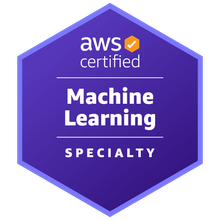
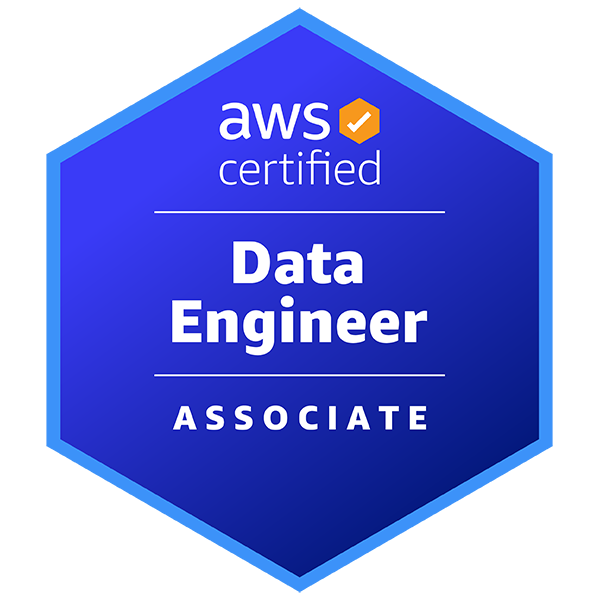

# Hello World, I'm Tahnia!  

## About Me

I build **intelligent systems that turn messy real-world data into decisions utilizing Machine Learning and Signal Processing pipelines and Multimodal RAG-based AI Systems**

***Current obsession:*** building **AI assistants that understand human behavior through a combination of biosignal, digital footprint, and behavioural data**.

## Machine Learning & Data Science

## Agentic AI

## Backend & APIs

## Frontend

## Cloud & Infrastructure

## Databases

## Documentation

## Software Testing

## Certifications

  
  &nbsp;&nbsp;
  

